# Submission to the KTC 2023

For this submission, we developed a **conditional diffusion model** for EIT segmentation. The conditional diffusion model is trained on a dataset of synthetic phantoms and simulated measurements.

# Table of contents 
1. [Usage](#usage)
2. [Method](#method)
3. [Examples](#examples)
4. [Evaluation](#evaluation)
5. [Authors](#authors)

## Usage

We provide the `environment.yml` file to restore the conda environment used for the submission. You can create the environment using the following command:

```
conda env create -f environment.yml
```

The network weights are stored [here](https://seafile.zfn.uni-bremen.de/d/59c291e4bf7d4064a1be/) and have to be stored in *diffusion_models*. They have to be loaded into *diffusion_models/level_{level}/model.pt*.
 We precomputed the Jacobian for an empty water tank, as well as some other matrices (smoothness regulariser, node coordinates). This eliminates the need to install FEniCS in the environment. All of these matrices are available [here](https://seafile.zfn.uni-bremen.de/d/9108bc95b2e84cd285f8/) and have to be stored in *data/*.


The script `main.py` can be used to reconstruct phantoms: 

```
python main.py /path_to_input_folder /path_to_ouput_folder difficulty_level
```

We take $N$ random draws of the diffusion model to get our final reconstruction. These $N$ samples are drawn in parallel, which require are suitable sized GPU. We included a variable **BATCH_MODE** in line 14. If **BATCH_MODE = True**, the model will try to draw the $N$ samples in parallel. If **BATCH_MODE = False**, all samples will be drawn in sequence. This option slightly changes the final prediction (as the random numbers are drawn in a different order) and is slower. Default **BATCH_MODE = True**. 

For reproducibility, we use a fixed seed for sampling.

### Enviroment

## Method

Our goal is to train a [conditional diffusion model](https://arxiv.org/abs/2111.13606), to sample from the conditional distribution $p(\sigma|c)$. Here, $\sigma$ denotes the conductivity map (interpolated to the $256 \times 256$ pixel grid) and $c$ some conditional input. Note that we do not use the raw measurements $U$ directly as the conditional input. Instead, we use an initial reconstruction method $\mathcal{R}$ and make use of the initial reconstruction $\mathcal{R}(U)$. Further, this initial reconstruction is interpolated to the $256 \times 256$ pixel grid. This has the practical advantage that we can implement the diffusion model as a convolutional neural network and the method is independent of the underlying mesh. 

Note that the backbone of our approach used exactly the same network architecture as in our other repository.

### Diffusion models

Diffusion models prescribe a forward process that gradually adds Gaussian noise to the data. This diffusion process transforms the data distribution $p_\text{data}(\sigma)$ of the conductivity $\sigma$ into a Gaussian distribution. The diffusion model is trained to reverse this process. Using the parametrisation of [Ho et al.](https://arxiv.org/pdf/2006.11239.pdf), this amounts to training a denoiser $\epsilon_\theta(\sigma_t, t)$,

$$ \min_\theta E_{t \sim [1,T], \sigma_t, \epsilon_t}[ || \epsilon_t - \epsilon_\theta(\sigma_t, t) ||^2], $$

which estimates the noise $\epsilon_t$ of the noisy sample $\sigma_t$ at time step $t$. As the forward diffusion process is a Gaussian, we can write the noisy sample $\sigma_t$ as 

$$\sigma_t = \sqrt{\alpha_t} \sigma_0 + \sqrt{1 - \alpha_t} \epsilon_t, \quad \epsilon_t \sim \mathcal{N}(0,I),$$

where $\sigma_0$ is a clean training image and $\alpha_t$ is a parameter from the forward diffusion process. In order to draw a sample from the data distribution $p_\text{data}(\sigma)$, we start with random noise $\sigma_T \sim \mathcal{N}(0,I)$ and iteratively apply the diffusion model. This concept can be extended to conditional diffusion by introducing an additional input $c$ to the model, i.e. $\epsilon_\theta(\sigma_t,c, t)$.  

We model $\epsilon_\theta$ as a time conditional diffusion model using the [guided diffusion](https://github.com/openai/guided-diffusion/tree/main) implementation. For sampling, we make use of the [DDIM](https://arxiv.org/pdf/2010.02502.pdf) framework. We directly train the network to recover the segmentation of the conductivity map, i.e. $\sigma$ is directly given as a $256 \times 256$ segmentation mask. This means that we are learning the conditional distribution of segmentation masks, given an initial reconstruction. 

The initial segmentation depends on the number of available measurements. We train an individual conditional diffusion model (using the same training setup and architecture) for each level of the challenge. 

For our final prediction of the segmentation mask, we take $N$ independent random samples from the conditional diffusion model and take the most frequent class per pixel.  In principle, this method would be able to give us an uncertainty map for the segmentation mask. 


### Initial Reconstructions

We use linearised time-difference reconstructions for the conditional input. Computing this linearised time-difference reconstruction amounts to solving a regularised least squares problem

$$ \Delta \sigma = (J_{\sigma_0} \Gamma_e^{-1} J_{\sigma_0} + \alpha_1 R_\text{SM} + \alpha_2 R_\text{Laplace} + \alpha_3 R_\text{NOSER})^{-1} J_{\sigma_0}^T \Gamma_e^{-1} \Delta U, $$

where $J_{\sigma_0}$ is the Jacobian w.r.t. to a constant background conductivity, $\Gamma_e^{-1}$ is the noise precision matrix and $\Delta U = U^\delta - F(\sigma_0)$ is the difference of the measurements. For $F(\sigma_0)$ we make use of the provided measurements of the empty water tank. 

We use a combination of three different priors, where $R_\text{SM}$ denotes a [smoothness prior](https://www.fips.fi/KTC2023_Instructions_v3_Oct12.pdf), $R_\text{Laplace}= - \bigtriangleup$ the graph laplacian and $R_\text{NOSER} = diag(J_{\sigma_0} \Gamma_e^{-1} J)$ the [NOSER](https://pubmed.ncbi.nlm.nih.gov/36909677/) prior. 

In total, we use five different combinations of $\alpha_1, \alpha_2$ and $\alpha_3$ as each regularisation results in different artefacts in the reconstruction. This means, that our conditional input, interpolated to the pixel grid, is of the size $5 \times 256 \times 256$. 

### Forward Operator 

For simulation, we used the forward operator provided by the organisers with the dense mesh. For the reconstruction process, we used a customized mesh. Further, we implemented the complete electrode model in FEniCS. This allows us to directly compute the Jacobian for the linearised reconstruction with FEniCS. Here, we use continuous piece wise linear functions for the potential and piece wise constant functions for the reconstruction of the conductivity. 

### Synthetic Training Data

We create synthetic conductivity images to train the conditional diffusion model. For this, we simulate a random number (1 to 4) of objects inside the water tank. In this context, we use circles, random polygons, and hand-drawn objects. We ensure that these elements do not intersect or overlap. Each object is then randomly assigned to be either conductive or resistive. Using this method, we create ~15.000 images per challenge level.

## Examples
### Level 1

<p float="left">
  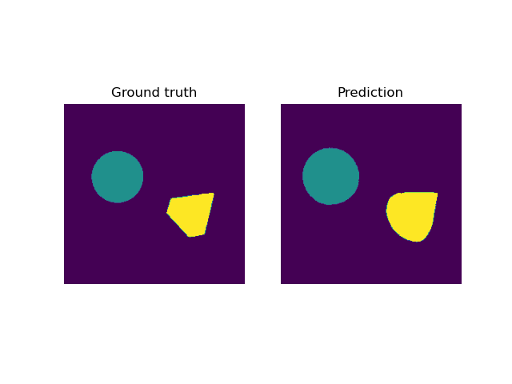
  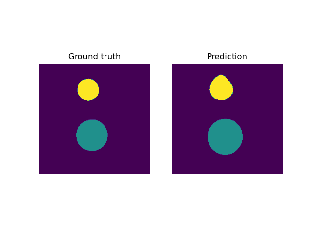
</p>

<p float="left">
  
  
</p>

### Level 2

<p float="left">
  
  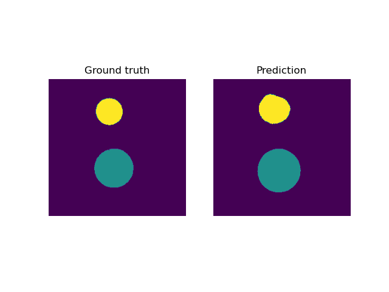
</p>

<p float="left">
  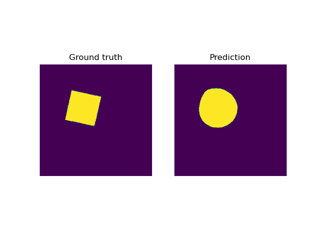
  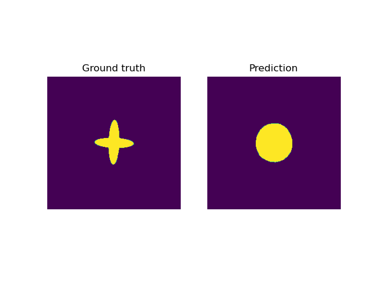
</p>


### Level 3

<p float="left">
  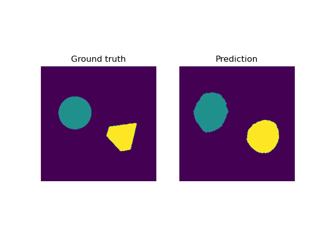
  
</p>

<p float="left">
  
  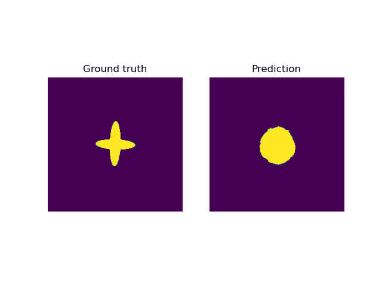
</p>

### Level 4

<p float="left">
  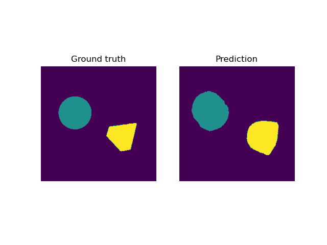
  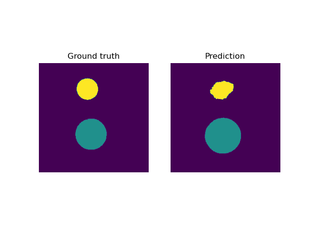
</p>

<p float="left">
  
  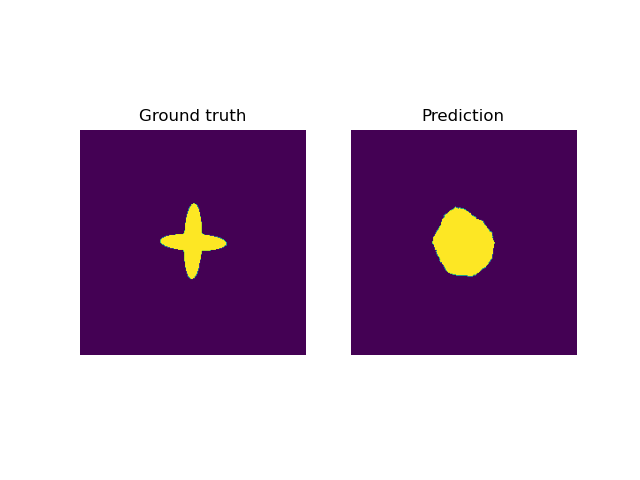
</p>

### Level 5

<p float="left">
  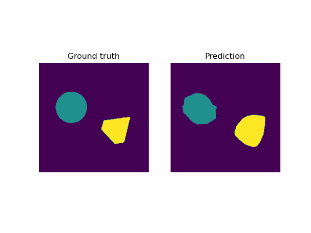
  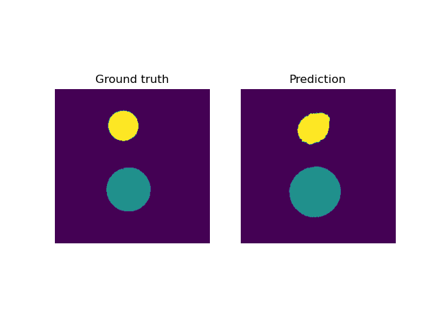
</p>

<p float="left">
  
  
</p>

### Level 6

<p float="left">
  
  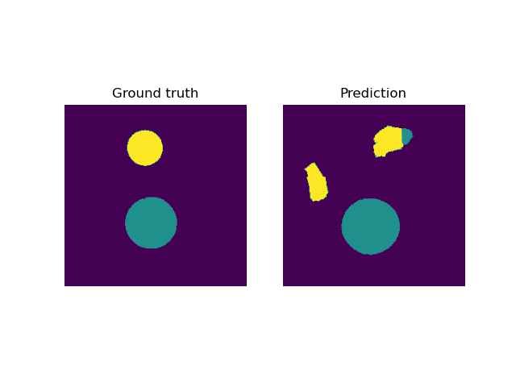
</p>

<p float="left">
  
  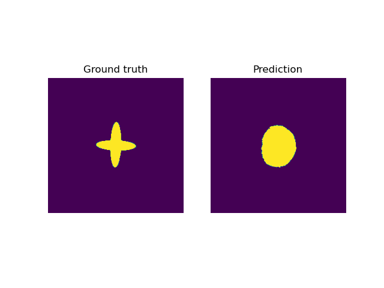
</p>

### Level 7

<p float="left">
  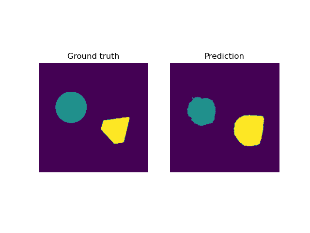
  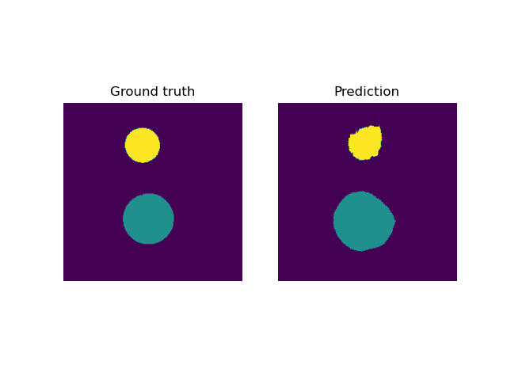
</p>

<p float="left">
  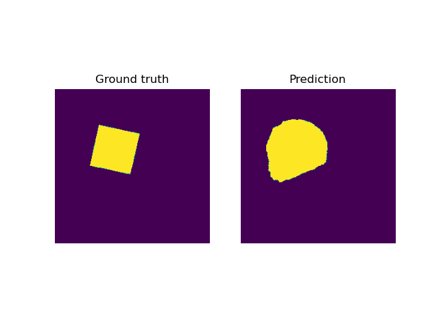
  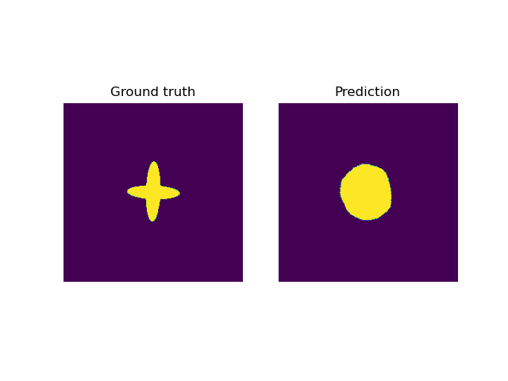
</p>

## Evaluation

We evaluate the conditional diffusion model w.r.t. the [score function](https://www.fips.fi/KTC2023_Instructions_v3_Oct12.pdf) used in the challenge. In the following we present the mean score over the four challenge phantoms:


| Level         |    Score       |
|---------------|----------------|
| 1            | $0.86$       |
| 2            | $0.84$       |
| 3            | $0.83$       |
| 4            | $0.83$       |
| 5            | $0.82$       |
| 6            | $0.72$       |
| 7            | $0.79$       |


## Authors

- Alexander Denker<sup>1</sup>, Tom Freudenberg<sup>1</sup>, Željko Kereta<sup>2</sup>, Imraj RD Singh<sup>2</sup>, Tobias Kluth<sup>1</sup>, Peter Maass<sup>1</sup>, Simon Arridge <sup>2</sup>

<sup>1</sup>Center of Industrial Mathematics (ZeTeM), University of Bremen, Bibliothekstr. 5, 28359 Bremen, Germany.

<sup>2</sup>Department of Computer Science, University College London, 66-72 Gower St, WC1E 6EA, London, United Kingdom.
